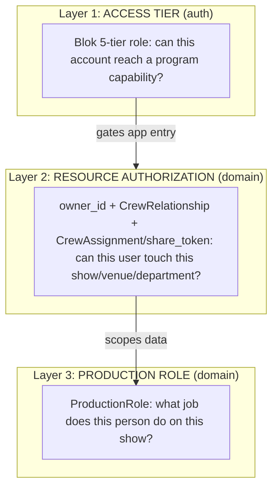
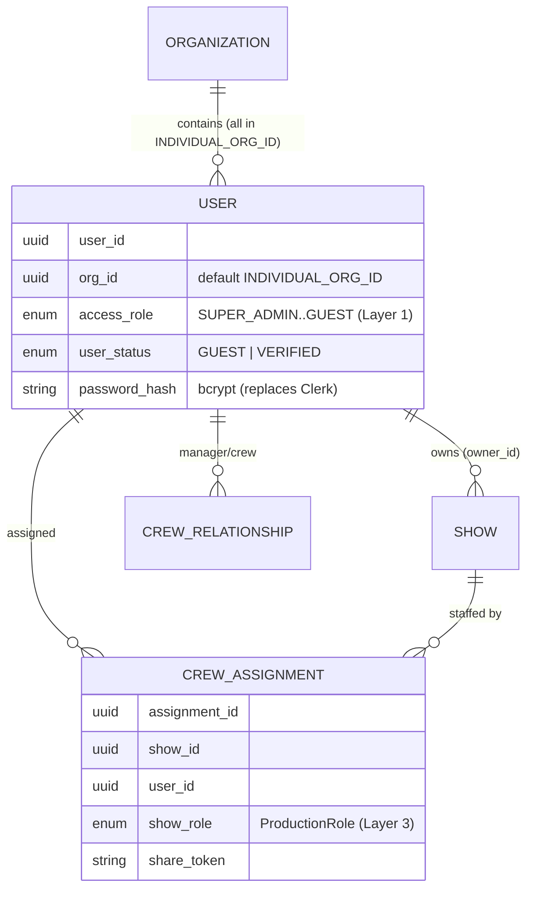

# Auth, Roles, and Tenancy: Blok 017 Migration Design

**Date:** June 2026
**Status:** Proposed (design decision; gates the AUTH milestone)
**Category:** System Architecture & Security

This document records the target authentication, role, and tenancy model for Cuebe's move off Clerk and onto Blok 017 (self-hosted auth). It is the design output of the "Roles & Multi-Tenancy Reconciliation" card. For the current (Clerk-era) model see `architecture/user-permissions-and-access-control.md`.

## Decision summary

Cuebe predates Blok and is single-tenant, so we adopt Blok 017 in a **hybrid** form: take the auth core (local accounts, bcrypt, JWT in HttpOnly cookies, sessions, MFA) and skip the multi-tenant organization model. Authorization stays where it already lives in Cuebe: ownership and crew relationships.

The key realization is that "role" in Cuebe has always meant three unrelated things. We separate them explicitly.

## The three layers

- **Layer 1, Access tier** is the only layer auth owns. It answers "can this account use the program / reach admin surfaces at all."
- **Layer 2, Resource authorization** is Cuebe's existing model and is unchanged. It replaces Blok's `org_id` scoping; a user can act on a show because they own it or are assigned to it.
- **Layer 3, Production role** is pure domain data describing function on a show. It carries no access meaning.

## Layer 1: Access tier

Adopt Blok's enum `UserRole` (SUPER_ADMIN > ADMIN > MANAGER > USER > GUEST) as a new `access_role` field on the user.

**Mapping decision** (the current `user_role` string is misleading: it is "admin" for every verified user, meaning "verified", not administrator):

| Current state | New `access_role` |
| --- | --- |
| `user_status = VERIFIED` (current `user_role = "admin"`) | `USER` |
| `user_status = GUEST` (current `user_role = "crew"`) | `GUEST` |
| Platform operators (set explicitly) | `SUPER_ADMIN` |

`ADMIN` and `MANAGER` tiers are reserved/unused for now. They become meaningful only if Cuebe later adopts real multi-tenant organizations.

## Layer 2: Resource authorization (unchanged)

No change. `owner_id`, `CrewRelationship` (manager to crew), `CrewAssignment`, and `share_token` continue to gate every resource. This is the substantive authorization layer and is a better fit for theater than tenancy.

> Trap: Blok's `MANAGER` access tier is unrelated to Cuebe's `CrewRelationship` "manager" (a crew lead). The crew-manager concept stays entirely in Layer 2.

## Layer 3: Production role

**Decision: constrain `CrewAssignment.show_role` to a `ProductionRole` enum.** Repurpose the currently-unused 20-value `UserRole` enum (`models.py:50`, values CREW, STAGE_MANAGER, LIGHTING_DESIGNER, ...) by renaming it `ProductionRole` and typing `show_role` as a native PostgreSQL enum (per Cuebe's enum standard, `SQLEnum`).

Caveat accepted with this choice: `show_role` is currently free text holding specific job titles ("Head of Sound", "Assistant LD") that the coarser enum does not cover one-for-one. This requires, as a migration task:

1. Audit existing `show_role` values in the database.
2. Map each to a `ProductionRole` value.
3. Expand the enum where a real title has no home (e.g. an assistant lighting designer), or fold it into the nearest value plus `OTHER`.
4. Migrate the column from `String` to `Enum(ProductionRole)`.

## Tenancy: organization as null-object

Blok 017 requires `org_id` on every user. Cuebe stays single-tenant by using Blok's default-organization pattern:

- Add `org_id` to the user, defaulting to `INDIVIDUAL_ORG_ID` (`00000000-0000-0000-0000-000000000000`).
- All existing and new users belong to that one default org.
- Org-scoped queries become no-ops; ownership (Layer 2) does the real scoping.
- The hook for future multi-tenancy (theaters/companies as orgs) exists but is dormant.

## Target data model

## What changes vs. what stays

**Stays:** ownership/relationship authorization, `UserStatus` (GUEST/VERIFIED), `CrewAssignment`/`share_token` sharing, Cuebe's own UI components.

**Changes / added:** `access_role` enum on user; `password_hash` and Blok session/MFA tables; `org_id` (null-object); `show_role` becomes a `ProductionRole` enum; the 20-value `UserRole` enum is renamed `ProductionRole`.

**Dropped:** Clerk (SDK, JWKS/RS256 verification, `clerk_user_id` coupling, webhooks). See the AUTH milestone's "Clerk Teardown" card.

## Migration implications (feed into Blok 000 / AUTH cards)

1. Add `access_role` enum; backfill from `user_status` (VERIFIED to USER, GUEST to GUEST); set operators to SUPER_ADMIN by hand.
2. Add `org_id`; backfill all to `INDIVIDUAL_ORG_ID`.
3. Rename `UserRole` to `ProductionRole`; audit/map `show_role`; migrate `String` to native enum.
4. Add Blok auth tables (users credentials, sessions, MFA, tokens) and `password_hash`; plan Clerk-user import (existing users reset password on first login).

## Open follow-ups

- Confirm who the explicit `SUPER_ADMIN` operator account(s) are.
- Decide whether `User.user_role` (string) is renamed to `access_role` or repurposed in place.
- Produce the `show_role` value audit before writing the enum migration.
